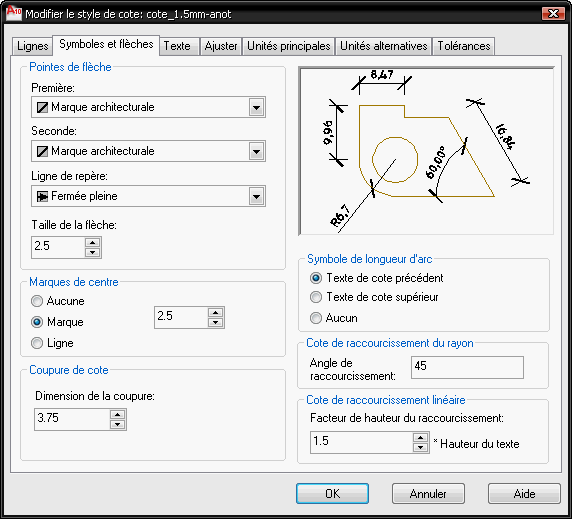
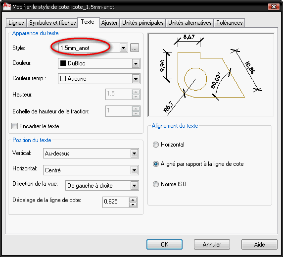
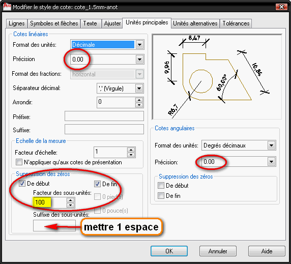
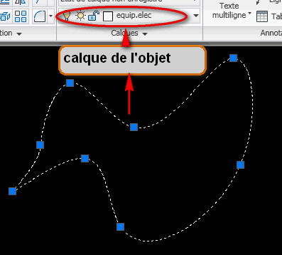

 .. _config-acad:

Configuration d'AutoCAD
=========================
La configuration d'|acad| est un vaste sujet : nous aborderons les éléments qui nous paraissent essentiels, liberté à vous d'interpréter ces lignes pour personnaliser encore plus finement le logiciel à vos besoins/envies.

Nous pouvons discerner 2 volets : la configuration *graphique* et la configuration *sous le capot*. Est-il nécessaire de préciser que le second volet est de loin le plus important? Nous apercevrons aussi que les paramétrages peuvent être soit exécutés au travers de menus (parfois changeants selon les versions d'|acad|), ou soit directement en ligne de commande (bien plus rapide et ... logiquement ... identique quelquesoit les changements de version)

L'objectif du paramétrage est de disposer, lors du démarrage d'|acad| d'outils adaptés à un travail productif :

* dessin en mètre
* styles de texte/cotes de hauteur fixe, quelquesoit l'échelle d'impression (1,5mm, 3mm et 5mm de hauteur)
* styles de traits basiques (fin/moyen/fort, de couleur )
* bloc dynamiques
* palette d'outils personnalisés
* liste de calques ()
* etc.

.. note::

   **Pour les impatients**

   Tous les réglages ci-dessous sont enregistrés dans un fichier **gabarit** :file:`mdl_teb0910_metre.dwt`, qui implique aussi une configuration d'imprimante, etc.

   Vous pouvez télécharger *directement* ces fichiers (gabarit+config imprimante) : :download:`ici <./fichiers/gabarit_acad2010_teb+imprimante_pdf.zip>` . L'archive contient aussi des instructions indiquant ou décompresser ces fichiers. Vous n'aurez plus qu'à indiquer le gabarit à utiliser par défaut au démarrage (comment ? : voir cette :ref:`section<chrgt-gabarit>`) et vous pouvez vous éviter la (fastidieuse, si si) lecture qui suit ...

Aspect graphique
-----------------

Accès rapide
~~~~~~~~~~~~
On commence par le haut ...

La personalisation de cette barre d'outil appporte les fonctionalités des versions "précédentes" d'|acad| (avant la version 2009). C'est donc un must, car une grande quantité de documents on été édité avant mars 2008 (sortie d'|acad| 2009).

Si vous cliquez sur la flèche (située à l'extrême droite de la barre d'outil) "personnaliser la barre d'outils accès rapide", une liste déroulante apparaîtra, et il faudra cliquer/cocher les éléments suivants :
   * copier les propriétés
   * aperçu du tracé
   * afficher la barre de menus

Couleurs espace objet/ ligne de commande
~~~~~~~~~~~~~~~~~~~~~~~~~~~~~~~~~~~~~~~~~~

En exécutant le menu (visible après son activation dans la personalisation de la barre d'outil d'accès rapide) :menuselection:`Outils --> Options` ou la commande :command:`options`, on affiche la fenêtre de paramétrage des options d'|acad|.

Allez sur l'onglet **Affichage**, puis cliquez sur le bouton **Couleurs**. Paramétrez comme suit (cela reste à votre convenance, ici, c'est pour l'example...) :

.. list-table::
   :widths: 20 40 40

   * - espace objet 2D
     - arrière plan uniforme
     - **Noir**
   * - ligne de commande
     - arrière plan uniforme
     - **Noir**
   * - ligne de commande
     - texte
     - **Blanc**

Espace de travail
~~~~~~~~~~~~~~~~~

Choisissez **Dessin 2D et annotations** dans la liste déroulante (boîte en bas à droite).

Cet "espace de travail" regroupe un arrangement spécifique d'icônes et de pré-réglages. On aperçoit notamment le **ruban**, révolution dans l'interface apportée depuis |acad| 2009.

Attention, il faut spécifier que l'on désire enregistrer les modifications : cochez l'option "enregistrer automatiquement les modifications des paramètres de l'espace de travail", après avoir cliqué sur le nom "Dessin 2D et annotations"

Perte du Ruban : comment le retrouver
~~~~~~~~~~~~~~~~~~~~~~~~~~~~~~~~~~~~~~
Faire la commande :command:`cui` : la fenêtre de personalisation de l'espace de travail s'affiche.

Affichez le panneau droit de cette fenêtre en cliquant sur les doubles-chevrons.

Panneau de gauche : cliquez sur Espaces de travail --> Dessin 2D et annotations

Panneau de droite : cliquez sur Palettes --> Ruban (ou Ribbon), et plus bas mettez la valeur de Apparence --> Afficher à *oui* .

        Affichage du ruban dans votre espace de travail

.. topic:: Note importante

    This section gives a quick summary of what is Mayavi, and should help
    you understand where, in this manual, find relevent information to
    your use case.

Palette/Groupe de personalisé
~~~~~~~~~~~~~~~~~~~~~~~~~~~~~~

1. Création du groupe et des palettes personnalisées

Une palette (pour en voir une : faites :kbd:`ctrl+3` pour afficher la palette "outils") peut être personalisée, pour ne contenir que les outils dont ont se sert le plus souvent (et que l'on a créé de toute pièce).

Cette personalisation ne peut intervenir qu'après avoir créé les outils de travail personlisés :
* styles de texte
* style de tableau
* blocs
* etc. : tout autre outil "perso".

Sur la palette : :kbd:`clic-droit` --> nouvelle palette (nom = **prénom_txt**). On vient de créer un onglet, apte à recevoir les styles de texte personalisés.

:kbd:`Clic-droit` sur bord palette --> personnaliser les palettes

Dans le panneau droit de la fenêtre qui s'ouvre : :kbd:`clic-droit` --> nouveau groupe (nom : **prénom** ) . On vient de créer le panneau (= groupe de palettes) regroupant toutes nos palettes. Attention de bien placer ce "groupe" (icône en forme de dossier) à la racine de l'arborecence, et non sous un autre dossier!

Depuis le panneau de gauche, faites "glisser" une ou ds palettes dans le nouveau groupe situé dans le panneau droit : la palette *prénom_txt* par exemple ...

Fermez la fenêtre, et de retour sur la palette "outils", faites un :kbd:`clic-droit` sur le bord et sélectionez le groupe "prénom" (situé vers le milieu-bas de la fenêtre) : il n'y a plus que votre groupe "prénom" d'affiché, et il contient la palette "prénom_txt"

Un petit :kbd:`clic-droit` sur la barre verticale de la palette --> > ancrage à droite. La palette vient se coller sur le bord droit de l'écran. Si elle apparaît sous forme de barre : :kbd:`clic-droit` --> icône seulement.

#. Ajout d'outils existants dans ces palettes (personalisées ou non ...)

Affichez le "Design Center" en faisant :kbd:`ctrl+2`. Si votre dessin contient des items à copier, ou un autre dessin, utilisez l'explorateur du panneau de gauche pour afficher le dessin voulu.

Depuis le panneau de droite du "Design Center" faites "glisser" les items vers le panneau de la palette qui doit le recevoir. C'est comme ça que je fais pour les blocs. Pour le reste, ce copier-coller "graphique"" marche plus ou moins bien ...

.. seealso::
  La configuration "fine" d'|acad| est contenue dans les fichiers de type :file:`*.cuix` . On peut le paramétrer directement avec la commande :command:`cui`. Avis aux amateurs ...

Barre d'état
~~~~~~~~~~~~

On finit par le bas ...

En cliquant sur la petite flèche noire, en bas à droite, "menu barre d'état de l'application", on va filtrer l'affichage/masquage de certains outils, jugés non nécessaires dans cet espace de travail (rappel : ce paramétrage est spécifique à l'espace de travail sélectionné, il sera différent du vore certainement ...)

La liste suivante indique ce qui doit être coché :
   * coordonnées du curseur
   * basculer l'état :
      - accrObj (F3)
      - reperObj (F11)
      - Épaisseur de ligne
   * papier / objet
   * pan
   * zoom
   * visibilité de l'annotation
   * échelle automatique

Sous le capot
--------------

Unités d'insertion
~~~~~~~~~~~~~~~~~~~

L'unité d'insertion contrôle l'importation des blocs & xref. Il faut que les 3 variables ci-dessous soient *identiques* et soit en *cm* (rentrer la valeur **5**) soit en *m* (rentrer la valeur **6**).

Ceci fait, vous n'aurez plus à redimensionner les blocs lors de leur insertion dans votre dessin, si ils ont étés déssinés en m!

Pour les blocs dessinés en mm, ce qui est souvent le cas, il faudra leur appliquer un facteur d'échelle uniforme (x et y) de facteur 1000 pour les avoir de dimension cohérente avec le reste du dessin en mètre.

Certaines personnes vont plus loin : elle definissent l'unité d'insertion globale à 0 (sans unité) par la commande :command:`insunits : 0`

et spécifient des unités variables pour l'insertion :command:`insunitsdefsource : 4` (insertion en mm)

Ça commence à devenir compliqué ...

.. list-table::
   :widths: 20 80

   * - **Variable Système**
     - **Valeur**
   * - :command:`insunits`
     - **6** (mètre)
   * - :command:`insunitsdefsource`
     - **6**
   * - :command:`insunitsdeftarget`
     - **6**

.. note::
  |su|, bien que configuré pour dessiner en *mètres*, règle l'unité d'insertion en *pouces* lors d'un export en dwg! lorsqu'on fait un export 2d en :file:`*.dwg` depuis |su|, il faut éditer le fichier pour régler les unités d'insertion à 6 (pour un dessin en mètre) ou à 5 (dessin en cm), avec la commande :command:`insunits`

Type de lignes
~~~~~~~~~~~~~~~

Exécutez la commande :command:`measurement`, et réglez ou vérifiez que la valeur à **1**. Cela charge le fichier :file:`acadiso.lin` qui correspond au type de ligne "métrique"

.. :guilabel:``

Unités
~~~~~~~~

Exécutez la commande :command:`unites`. (ou par le menu : :menuselection:`A --> utilitaires de dessin --> unités` )

Dans la fenêtre qui s'affiche, réglez les paramètres comme suit :

.. list-table::
   :widths: 20 40 40

   * - **Variable**
     - **type**
     - **valeur**
   * - **longueur**
     - type : decimal
     - précision : 0,00
   * - **angle**
     - type : décimal
     - précision : 0,00
   * - **échelle insertion**
     - (correspond à :command:`insunits`)
     - mètre

Calques
~~~~~~~~

Il est bon d'avoir une série de calques prête à acueillir toute sorte de dessins, objets insérés, etc. Cette liste évolue au fur et à mesure des besoins, en fonction des projets/intervenants, etc.

Voici une liste minimale de calques :

.. list-table::
   :widths: 20 20 20 40

   * - **Calque**
     - **couleur**
     - **epaisseur ligne**
     - **impression**
   * - **brouillon**
     - magenta
     - default
     - **non**
   * - **trait_fin**
     - jaune
     - 0,25
     - oui
   * - **trait-moyen**
     - vert
     - 0,50
     - oui
   * - **trait_fort**
     - bleu
     - 0,70
     - oui
   * - **cotes**
     - vert
     - defaut
     - oui
   * - **texte**
     - vert
     - defaut
     - oui
   * - **fenetre_impression**
     - magenta
     - defaut
     - **non**
   * - **cartouche**
     - noir
     - defaut
     - oui
   * - **blocs**
     - noir
     - defaut
     - oui
   * - **images**
     - noir
     - defaut
     - oui
   * - **pdf**
     - noir
     - defaut
     - oui
   * - **xrefs**
     - noir
     - defaut
     - oui
   * - **objet/niveau ...**
     - ...
     - ...
     - ...

Vous remarquerez que les 2 seuls calques non imprimables sont dans la même couleur magenta

Style de texte
~~~~~~~~~~~~~~
Utilisons une nouveauté introduite dès |acad| 2008 : le style de texte **annotatif**.

Le concept est très simple, et rejoint dans ce sens les autres logiciels de dessin architecturaux : on définit une hauteur de texte pour l'impression (pdf ou papier) et le logiciel fait le reste, pour adapter le texte à cette hauteur, indépendemment de l'échelle.

Un texte annotatif paramétré à 3 mm, sera à 3 mm de haut lorsque imprimé, que cela soit dans une fenêtre à l'échelle 1/50e ou 1/10e!

Affichage de la fenêtre "Style de texte" : par la barre de menus :menuselection:`format --> style de texte` ou par la ligne de commande :command:`style`

.. figure:: img/style_txt-1.5mm-anot.png

#. Style de texte 1,5 mm de hauteur (cotation)
      * clic sur le style de texte **Annotatif** dans le panneau gauche
      * choix de la police : **Tecnic** (cette police ne possède que la fome peite et "grande" majuscule. Elle simule l'écriture au Rotring, et a cette hauteur, reste lisible puisque en petite majuscules)

      * style : standard (il vaut mieux éviter les styles exotiques, c'est pour du dessin technique ...)
      * taille : **annotatif**
      * hauteur texte : **1.5** (correspond à 1,5 mm en espace papier)
      * facteur de largeur : 1
      * angle oblique : 0
      * enregistrez ce style avec une appellation explicite : :file:`1.5mm_txt-anot` par exemple
      * rendez ce style courant
#. Style de texte de hauteur 3 mm (textes généraux)
      * choisissez la police **Tahoma** (permet la minuscule, mais reste assez étroite), avec un style standard
      * la hauteur sera réglé à **3**
      * le reste est inchangé (ne pas rendre ce style courant!)
#. Style de texte de hauteur 5 mm (titres)
      * police **Arial** en style standard (plus large que Tahoma)
      * hauteur **5**

.. .. sidebar:: For an even more isolated build environment...
..   To use an isolated instance of Python within the project, the following
..   commands will create a new sandbox and establish use of *zc.buildout*
..   within it.

Style de Cotes
~~~~~~~~~~~~~~

On adaptera le style de cote pour qu'il utilise le style de texte annotatif défini précedemment.

Affichage de la fenêtre de configuration : choisissez le plus court! :command:`cotstyle`

..  figure:: img/cotstyle_00.png

1. modification d'un style **Annotatif** existant :

.. figure:: img/cotstyle_0.png

2. modification des lignes (blocage de la longueur des lignes de rappel à 5 mm)

3. modification des symboles et flèches (utilisation du style "architectural")

4. modification du texte de la cote (utilisation du style de texte annotatif de hauteur 1.5 mm : c'est petit mais ça passe partout)

5. modification des unités principales 2 zéros pour les longueurs et les angles, et les longueurs inférieures au mètre seront comptées en cm)

6. N'oubliez pas d'enregistrer le style de cote sous un nom explicite, qui rappelle le style de texte par exemple ...

7. Il ne vous reste plus qu'à créer un deuxième style, employant un texte plus grand (3 mm ?), et à l'enregistrer sous le nom :file:`3mm_cot-anot` par exemple.

Avec ce réglage, lorsque vous coterez des éléments d'une longueur inférieure au mètre, la valeur de la cote sera en cm. C'est pratique pour coter les cloisons d'une construction dessinée en m : les épaisseurs apparaîtront en cm, comme sur cette capture d'écran :

.. figure:: img/cote_m+cm.png

Style de tableau
~~~~~~~~~~~~~~~~~~~

Par le menu :menuselection:`Format --> style de tableau` on affiche la fenêtre de configuration des styles de tableau.

Créons un nouveau style, qui utilisera les styles de texte annotatifs précédents, dans les hauteurs de 5 mm pour le titre, 3 mm pour les en-têtes (=sous titres) et 1.5 mm pour les cellules de données.

On peut faire extrêmement "joli" pour les tableaux, mais cela dépasse le cadre d'une initiation ...

N'oublions pas d'enregistrer ce nouveau style de tableau sous une appellation différente de standard, et de le rendre courant.

Style de points
~~~~~~~~~~~~~~~~~~

Choisir la croix inclinée à 45 deg.

Style de repères multiples
~~~~~~~~~~~~~~~~~~~~~~~~~~~~~~

Créeez un nouveau style faisant appel à du texte annotatif de 3 mm de hauteur.

les variantes à ce nouveau style sont dans

* le type de ligne de repère :
      * en ligne brisée (il est même possible de spécifier le nombre de segments et l'inclinaison des segments de façon constante)
      * en *spline* (il est possible de spécifier le nombre de points de construction)
* le type de contenu :
      * texte multiligne
      * ou bloc (pour faire une étiquette), dont il faut régler l'échelle d'insertion (un facteur compris entre 50 et 100 semble correct (cas d'un dessin "pensé" en m, et réglé à 6 (mètres) pour l'insertion de blocs))

C'est le moment de créer plusieurs styles de repère multiples et de les enregistrer sous une appellation permettant de les différencier!

.. figure:: img/styles_reper-multiples.png

La pratique vous fera déterminer lequel devra être courant!

Imprimantes
~~~~~~~~~~~

Nous pouvons configurer une imprimante par défaut. Cette configuration reste néammoins dépendante de l'ordinateur qui accueille le dessin.

.. note ::

    ** Imprimantes matérielles et imprimantes système **

    Vous avez 2 types d'imprimantes dans votre ordinateur : celles qui se voient et les autres. Nous utiliserons le 2ème type en premier (imprimante ``pdf``) et le premier en dernier (imprimante A3+A4 "HP OfficeJet K8600") pour l'impression du pdf sur le papier.

Le travail de création/modification d'une imprimante fait partie de la configuration de la mise en page : :ref:`voir ci-dessous<mise-en-page>` pour la configuration de l'imprimante système :file:`DWG To PDF`.

L'impression fait partie intégrante de la stratégie de sauvegarde :
   * *si le fichier informatique est perdu il reste l'impression ...* : on peut étendre cet adage *tibétain* et renforcer son application en ...
   * si l'impression est effectuée vers un format de visualisation, on pourra toujours voir le fichier (sortie :file:`*.pdf`), sans avoir besoin de l'application d'origine : pratique

.. _mise-en-page:

Mise en page
~~~~~~~~~~~~~
Mise en page **nommée** : plutôt que de configurer la présentation (choix imprimant, format papier, etc.) de façon *unique*, il vaut mieux en créer une de façon *générique*.

Cette méthode de création d'une mise en page permet :
   * d'appliquer cette mise en page "nommée" à autant de présentations que l'on souhaite
   * d'importer des mises en pages nommées provenant d'autre dessins.

Affichons la fenêtre de création/modification des mises en page :
   * soit par le menu |acad| 2010 :command:`A --> imprimer --> Mise en page` ,
   * soit par la barre de menus : :command:`Fichier --> gestionnaires des mises en pages`
   * soit en activant une présentation (en faisant un :kbd:`clic-gauche` sur l'onglet d'une présentation) puis en faisant un :kbd:`clic-droit` --> gestionnaire des mises en pages

Nouvelle mise en page "nommée" :
   * cliquez sur le bouton *nouveau*
   * nommez cette nouvelle mise en page, par exemple :file:`A3H_pdf`

Configuration mise en page :
	* choix imprimante :file:`DWG To PDF`, et cliquez sur "configuration" :
		- formats de papier :
			- filtrage des formats, on déselectionne tout
			- puis on sélectionne uniquement les formats que l'on souhaite utiliser
		- marges :
			- réglons les marges des formats de papier sélectionnés à 10 mm, pour chaque coté
			- on doit effectuer ces réglages pour chaque format de papier
	* enregistrement sous un nouveau nom de fichier :file:`*.pc3`, par exemple :file:`DWG_To_PDF_A0+A1+A2+A3+A4_marges-10mm`, qui permet de savoir immédiatement quel est son usage ...

Présentations
~~~~~~~~~~~~~

Autrement appelé "Espace Papier", elles correspondent aux impressions papier.

Il est utile de préconfigurer celle-ci pour disposer de feuilles vierges, aux formats d'impression courants (A4 portrait, A3 paysage, A2 portrait, A1 paysage, A0 et doubleA0).

Ces feuilles contiendront un cartouche (on essaiera d'y inclure des textes "automatiques" via des "champs", mais on n'utilisera pas la fonction d'attribut de bloc, qui permet d'ajouter du texte selon une suite de questions/réponses, car ce système est lourd à gérer).

Pour les imprimer, il faudra configurer une imprimante, système (:file:`PDF TO DWG`, excellente sur |acad| 2010, pdfcreator, etc.) ou matérielle (traceur Océ, HP A3 grand public ...), et d'autres paramètres, vu à cette :ref:`section<mise-en-page>`.

Rotation d'une vue dans la présentation :
   * déplacez-vous en espace papier, en cliquant sur l'onglet de la présentation où vous désirez faire un rotation (typiquement : les façades)
   * activez le mode objet, en faisant un :kbd:`double-clic` à l'intérieur de la fenêtre d'impression, en en rentrant la commande :command:`eo`
   * faites la commande :command:`vuedyn`
   * sélectionnez les objets que vous voulez faire touner
   * entrez :command:`b` (pour "Basculer")
   * et appliquez une rotation de 90

Attention : cette manipulation ne marche que si vous avez ectivé le mode objet en présentation. Attention à la molette de la souris dans ce mode : une simple pression modifie l'échelle du dessin!

Masquage d'un calque sur une présentation spécifique (en le laissant affiché sur les autres) :
   * déplacez-vous en espace papier, en cliquant sur l'onglet de la présentation ou vous voulez masquer un calque
   * activez le mode objet, en faisant un :kbd:`double-clic` à l'intérieur de la fenêtre d'impression, en en rentrant la commande :command:`eo`
   * affichez la palette du gestionnaire des calques
   * cliquez sur **gel de la fenêtre**

.. figure:: img/gel-calque_en-presentation_02.png

.. figure:: img/gel-calque_en-presentation_03.png

Attention : cette manipulation ne marche que si vous avez activé le mode objet en présentation!.

Faites aussi attention à la molette de la souris dans ce mode objet : une simple pression modifie l'échelle du dessin!

Pour vérifier l'échelle, lorsque vous avez fini :
   * repassez en mode papier (en faisant un :kbd:`double-clic` à l'extérieur de la fenêtre ou en tapant la commande :command:`ep` )
   * cliquez sur le bord de la fenêtre d'impression (doit être de couleur magenta si vous l'avez placée dans le bon calque ...)
   * vérifiez l'échelle en regardant ce qui est affiché dans la boîte "échelles" (en bas à droite)

Échelles
~~~~~~~~~~~

La liste d'échelles  est longue, mais peu utile pour un dessin en mètres ou en cm : il faut la nettoyer de toutes les echelles "impériales" et ajouter les échelles pour le dessin architectural (mètre et centimètre)

Cartouche
~~~~~~~~~

Une présentation avec un cartouche tout prêt, c'est bien.

Fichiers
~~~~~~~~~

Affichez la fenêtres "options" en tapant la commande éponyme :command:`options`

Type de fichiers (version par défaut) :
   Qui possède |acad| 2010 aujourd'hui? Indiquons lui d'enregistrer les fichiers au format |acad| 2004 par défaut. On pourra ainsi travailler avec |acad| 2010 au quotidien, et échanger nos fichiers avec les utilisateurs d'|acad| de la version 2004 à 2010 ...

.. _chrgt-gabarit:

Chargement du gabarit :
   Indiquez à |acad| de charger le gabarit que vous venez de créer : :file:`mdl_teb0910_metre.dwt` et indiquons dans :menuselection:`outils --> options --> fichiers` le fichier modèle à charger au démarrage.

.. |su| replace:: Sketchup

.. |acad| replace:: AutoCAD
