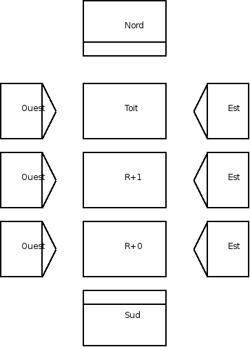

Édition dans AutoCAD
====================

On vient d'exporter des "vues" ou "coupes" (revoir la :ref:`méthode<export-dwg>` ) 2D du modèle 3D "Porkeno" (plans R+0 & R+1, façades Nord, Sud, Est & Ouest) au format dwg.

Ces fichiers sont placés dans le dossier **xrefs** qui est inclus dans le dossier *dwg* du projet. (revoir :ref:`l'arborescence <arborescence-projet>`  type)

Réglage de l'unité d'insertion en mètres
------------------------------------------

Nous avons dessiné en mètres dans |su|, mais ce facétieux logiciel exporte des :file:`*.dwg` avec un format d'insertion en *pouces* !

Utilisons la commande :command:`insunits` en l'écrivant dans la "ligne de commande" d'|acad|

Fichiers exportés par |su|
~~~~~~~~~~~~~~~~~~~~~~~~~~

Dans le dossier :file:`xrefs`, ouvrons un fichier exporté par |su|, par exemple :file:`porkeno_plan-R+0_export2D-sketchup.dwg` en double-cliquant sur son nom dans l'explorateur windows.

Un fois |acad| lancé (le chargement du ruban est accéléré par rapport à |acad| 2009, mais ça prend encore du temps, surtout avec des ordinateurs dotés d'une carte graphique "asthmatique"!), ouvrons les autres fichiers, depuis autocad, par la commande :menuselection:`fichier --> ouvrir` ou le raccourci :kbd:`ctrl+o`

Autocad a maintenant 7 fichiers ouverts (plans R+0, R+1 et toiture, façades Nord, Sud, Est et Ouest). On peut passer de l'un à l'autre par le menu :menuselection:`fenêtres -->` (voir la page configuration d'|acad| pour afficher ce menu) oupar le raccourci :kbd:`ctrl + tab`

Appliquons le réglage sus-mentionné en écrivant la variable suivante :command:`insunits` et en réglant sa valeur (20 possiblités !) à **6**. Cette commande est le raccourci correspondant au menu :menuselection:`A --> utilitaires de dessin --> unités` qui provoque l'affichage de la fenêtre *Unités* (affichable directement avec la commande "texte" éponyme), sur laquelle il faut indiquer *mètre* en ce qui concerne les unités d'insertion ... Avouez que la ligne de commande est franchement plus rapide dans certains cas!

Il efectuer ce réglage avec :command:`insunits : 6` à tous les fichiers :file:`*.dwg`  créés par |su|, les enregistrer et les fermer.

Nouveau fichier "Hôte" des exports de |su|
~~~~~~~~~~~~~~~~~~~~~~~~~~~~~~~~~~~~~~~~~~~~~

Toujours dans |acad|, ouvrons un nouveau fichier par la commande :menuselection:`fichier --> nouveau` ou le raccourci :kbd:`ctrl + n`.En configuration par défaut (c.a.d que |acad| ouvre le gabarit :file:`acadiso.dwt`), il faut changer *aussi* l'unité d'insertion qui est par défaut en mm (insunits : 4). Cette étape ne s'applique pas si vous avez configuré |acad| selon :ref`config-acad` !

Réglons l'unité d'insertion en mètres, avec la commande :command:`insunits : 6`

Enregistrons ce fichier dans le dossier :file:`dwg` sous le nom :file:`porkeno_plan+coupe+facades_<auteur>_<date>.dwg`. Réglez les variables "auteur" et "date" à votre convenance. Le changement de nom de ce fichier n'aura pas d'influence sur l'insertion en *xref* des fichiers exportés par |su|

Import en xref
---------------

Le fichier :file:`porkeno_plan+coupe+facades_<auteur>_<date>.dwg`  est vide.

Nous allons y "copier" les fichiers créés par |su| de façon *bidirectionnelle* : si l'on modifie le fichier "invité" , le fichier "hôte" le sera aussi.

Cette façon d'insérer un(des) (ou plusieurs dans notre cas ...) dessin(s) "invités" dans un autre "hôte" permet de reporter des modifications *automatiquement*. Il est ainsi facile de modifier l'esquisse originale dans |su|, de ré-exporter les vues axono dans les mêmes fichiers :file:`dwg` (en gardant **absolument** le même nom, donc en écrasant les anciennes versions) : le fichier "hôte" en sera "automagiquement" modifié!

Insertion de la première xref
~~~~~~~~~~~~~~~~~~~~~~~~~~~~~~~

#. clic sur insertion --> réference externe

#. choisissez, dans le sous-dossier :file:`xref`,  le fichier :file:`porkeno_plan-R+0_export2D-sketchup.dwg`

#. type de chemin **relatif** (possible puisque le nouveau dessin "hôte" est **enregistré**) : cela permet d'enregistrer l'arborescence complète du projet sur un autre emplacement (2ème ordinateur, clé usb, etc.) sans perdre les xrefs (le chemin relatif enregistre uniquement les informations de positionnement de la xref, relativement au dessin "hôte", comme :file:`../porkeno_plan+coupe+facade_o.turlier_14juin-15h20.dwg`, et pas jusquà la racine complète, i.e. :file:`D:/Mesdoc/olivier/projets/porkeno/dessins/dwg/porkeno_plan+coupe+facade_o.turlier_14juin-15h20.dwg` )

#. La seule "coche" à laisser est "spécifiez le point d'insertion à l'écran"

Insertion des suivantes
~~~~~~~~~~~~~~~~~~~~~~~~

#. une fois le R+0 inséré, faites de même pour le R+1 (à positionner au dessus, à la verticale),

#. puis la toiture,

#. et les façades, à disposer sur les cotés des plans correspondants (vue des projections à l'américaine).

Copie des xrefs
~~~~~~~~~~~~~~~

..          disposition des xrefs (insertion puis copie)

#. pour plus de clarté dans la présentation, n'hésitez pas à faire des copies des xrefs avec la commande :command:`copie`, pour disposer les ouvertures en regard : en traçant des lignes de brouillon des ouvertures de la façade Est, on doit "tomber" exactement sur les ouvertures en plan (rez de chaussée ou autre niveau ...). De même, il est préférable d'aligner les xrefs en vertical comme ne horizontal, grâce à des lignes de repère "brouillon".

#. il est bon, toujours dans les copies, de disposer aussi les façades de façon alignée, sur la même ligne horizontale, idéalement le niveau +- 0,00 archi.

Création des calques nécessaires
----------------------------------

En partant du principe que vous utilisez un |acad| "standard", qui n'a pas utilisé un fichier de gabarit "personnalisé", il faut au moins créer quelques calques permettant de travailler de façon ordonnée :

.. list-table::
   :widths: 20 20 20 40

   * - **Calque**
     - **couleur**
     - **epaisseur ligne**
     - **impression**
   * - **brouillon**
     - magenta
     - default
     - **non**
   * - **trait_fin**
     - jaune
     - 0,25
     - oui
   * - **xrefs**
     - gris
     - defaut
     - oui

Sélectionnez toutes les "xrefs" (fichiers :file:`dwg` créés par |su|) en cliquant une fois dessus et sélectionnez le calque "xrefs" dans la liste déroulante.

Traçage des lignes de construction
------------------------------------

Activez le mode "ortho" (trait uniquement horizontaux ou verticaux) en appuyant sur la touche :kbd:`F8` (vous pouvez lire dans la ligne de commande : ``<ortho actif>``)

Activez le calque "brouillon" et commencez à tracer un trait vertical sur l'arête extérieure gauche du plan R+0 importé en xref (mur extérieur).

Décaler ce trait vers la droite d'une valeur de 36 cm en rentrant la valeur :command:`0.36`.

Faites de même pour toutes les arêtes déterminant un mur, une cloison, etc., en vous aidant du plan fourni à cette page :ref:`porkeno-plans-simples`, ou pour plus de facilité :  :download:`là <./fichiers/porkeno_plans-simples_o.turlier_03juin09_09h00.pdf>`

L'important est de ne pas s'accrocher sur la géométrie existante des "xrefs" créées par |su| et importées dans ce dessin, mais de se servir des cotes indiquées par le plan :file:`*.pdf`. Les xrefs servent uniquement de *fond de plan* : on ne peut se fier à |su| pour créer une géométrie exacte !

Une fois que les arêtes verticales sont tracées par décalage, faites de même pour les horizontales.

Traçage des contours du plan
------------------------------

Traçage initial "au kilomètre" (édition)
~~~~~~~~~~~~~~~~~~~~~~~~~~~~~~~~~~~~~~~~

.. note::
   Première approche d'une méthode de traçage "rigoureuse" (dimensions exactes): ne l'appliquez que sur le plan R+0. Les étapes suivantes seront plus "réfléchies", i.e : les arêtes seront dessinées à leur bonne épaisseur "à l'avancement"

#. Activez le calque ``trait_fin``

#. Estompez la visibilité du calque ``xrefs`` (60% maximum)

#. Dessinez des lignes allant d'une intersection de ligne de construction à l'autre, en vous aidant avec les xrefs.

.. note::

   Nouveauté |acad| 2010 : l'inportation d'un calque sous-jacent en :file:`*.pdf` est possible, et **recommandée**. Si le pdf a été bien dessiné, les traits de celui-ci sont "accrochables" : on peut dessiner une géométrie en se calant directement sur le :file:`*.pdf` sous-jacent.

   Hélas, si vous désirez exporter votre dessin dans une version antérieure à |acad| 2010, vous ne pourrez plus apercevoir le :file:`*.pdf`, car c'est une fonctionalité *réservée* à la version d'|acad| 2010

#. Lorsque vous avez tracé tous les contours, vous pouvez masquer(= "geler") le calque "brouillon"

On s'aperçoit que les épaisseurs de lignes ne correspondent pas aux conventions architecturales : les arêtes coupées sont en trait fin, alors qu'elle devraient être en trait fort

Changement épaisseur des lignes (modification)
~~~~~~~~~~~~~~~~~~~~~~~~~~~~~~~~~~~~~~~~~~~~~~

Les ligne de traits fin correspondant aux arêtes vues doivent être interrompues aux intersections avec les arêtes coupées qui doivent être en traits forts.

Il y a 2 solutions :

#. l'une - hélas - trop souvent utilisée (elle "pollue" le dessin par la superposition de lignes) consiste à **redessiner** en traits forts sur les traits fins (pour nettoyer les lignes dupliquées, heureusement qu'il y a un outil dans "Express Tools" (en anglais uniquement!) : :menuselection:`Express Tools --> find duplicates`)

#. l'autre plus élégante, consiste à couper les lignes aux intersections où elles doivent changer d'épaisseur, en utisant l'outil :command:`couper au point`. C'est efficace, (sélectionnez la ligne à couper, puis l'intersection où elle doit être coupée), mais long! Il faut répeter cette opération à chaque point (pas d'option "multiple" à ma connaissance), et en plus, je ne sais pas pourquoi, |acad| se met souvent à couper non plus au point, mais aussi un petit segment : il faut alors rallonger la ligne coupée! Une fois coupée, il faut changer le calque de la la ligne en la sélectionnant, puis en cliquant sur le calque désiré (``trait_forts`` dans notre cas)

.. warning::

   Les propriétés des entités de dessin dépendent des calques auxquels elles appartiennent! i.e. une ligne est épaisse, de couleur rouge, etc. parce que le calque sur lequel elle est tracée a comme propriété : couleur=rouge, épaiseur ligne=0.70, etc.

    \
   Dans la fenêtre propriétés, on doit toujours voir "Du Calque/Du Calque/Du Calque" pour les paramètres couleur/épaisseur/style de ligne

   Par pitié, n'ayez pas l'idés saugrenue de modifier les propriétés d'un ligne de façon "individuelle" , de façon différente de son calque! Vos modifications ultérieures risquent de devenir un cauchemar!

Pour rallonger un ensemble de lignes, *de façon rigoureuse...*, il faut utiliser l'outil :command:`prolonger`. Celui-ci "demande" (lisez, lisez & re-lisez la ligne de commande ...) de sélectionnez une ligne faisant office de repère de prolongation ou tout : choisissez cette option en validant (le :kbd:`clic-droit` est votre ami le plus rapide pour la validation ...). Donc, en résumé, :menuselection:`prolonger --> clic-droit --> selection des lignes à prolonger`

.. note::

   Les méthodes de sélection sont nombreuses dans |acad| et il est utile de les connaître.

   De nombreuses commandes, généralement du groupe *modifications* (supprimer, déplacer, rotation, copie, etc.) demandent de sélectionner des objets, lignes, etc. et l'on peut :
   * sélectionner les entités (objets, lignes) une à une, en cliquant dessus (ajout automatique)
   * sélectionner un groupe d'entités:
       - en traçant une **fenêtre** de capture (forme rectangulaire) *partielle* (pas besoin d'inclure les entités en entier) : 1er clic coin droit haut, puis "glisser" vers le coin bas gauche
       - en traçant un **chemin** de capture : lorsque qu'une commande vous "demande" de sélectionner, cliquez sur :command:`T`, et tracez un "trajet" de sélection (en cas de traçage au sein d'une géométrie complexe, il peut être utile de désactiver l'accrochage objet en cliquant sur la touche :kbd:`F3`, et attention, l'option :command:`trajet` ne marche que pour la portion visible à l'écran : vous ne pouvez pas tracer un trait d'un bord à l'autre, et le continuer ne déplaçant les objets)
       - en traçant un **polygone** de capture (forme angulaire quelquonque) : à l'invite de sélection, tapez :command:`CP` et tracez un polygone incluant (partiellement) les entités à sélectionner. Attention, la limitation d'effet de la commande à la portion visible de l'écran s'applique aussi ...

Vous comprenez qu'il est fastidieux de modifier après coup un grand nombre de lignes : il est préférable de répérer à l'avance quelle épaissuer doit avoir le trait à tracer, et de semettre dans le calque idoine. Cela s'appelle de la préparation ... La fable de Jean de la Fontaine `le lièvre et la tortue <http://www.leplaisirdapprendre.com/Le-lievre-et-la-tortue.html>`_ nous en rappelle les vertus...

La suite est simple : une fois les contours tracés (à leur bonne épaisseur, que l'on peut visualiser en cliquant sur le bouton du bas :command:`el`), on passe à la 

Cotation
--------

Cela nécessite de configurer au préalable (si ce n'est pas déjà fait) :

      * les styles de texte (on créera des styles ayant des propriétés "annotatives")
      * les styles de cote (appelant les styles de texte définis auparavant)
      * les échelles / échelles d'annotation (création pour le dessin en mètre et pour le dessin en centimètre et suppression des échelles impériales)

puis à la 

Mise en page
-------------

dans les présentations (= espace papier) : cela implique de créer/configurer au préalable (si ce n'est pas déjà fait) :

      * un cartouche
      * une imprimante "système" qui exporte le :file:`*.dwg` en :file:`*.pdf` : celle fournie par |acad| 2010 **DWG To PDF** est excellente!
      * une mise en page nommée, appelant l'imprimante ci-dessus, dans des formats de papier compatible avec notre matériel : du A3 paysage par exemple

enfin à l'

Impression en pdf
------------------

et à 

Imprimer du pdf sur du papier
-----------------------------

Voilà!

Il faut donc se tourner vers la page :ref:`config-acad` pour arriver à mener à terminer ces étapes dans un délai raisonnable, mais aussi pour avoir un rendu similaire ...

.. |su| replace:: Sketchup

.. |acad| replace:: AutoCAD
