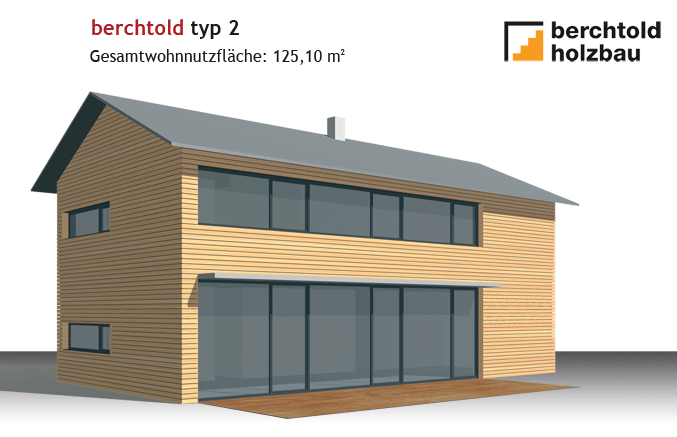
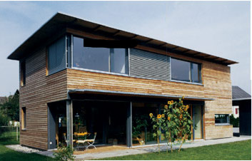
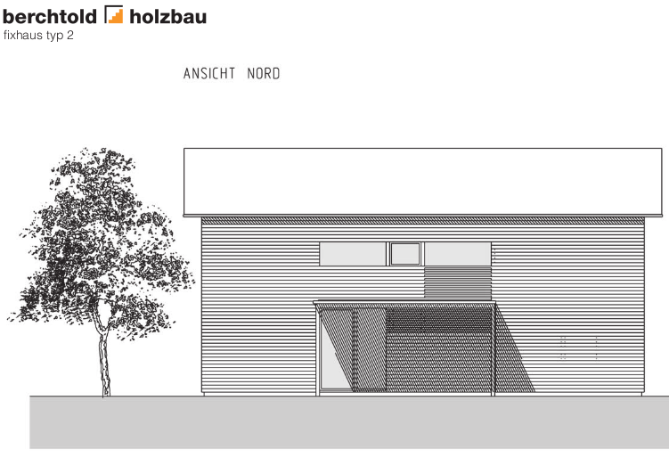
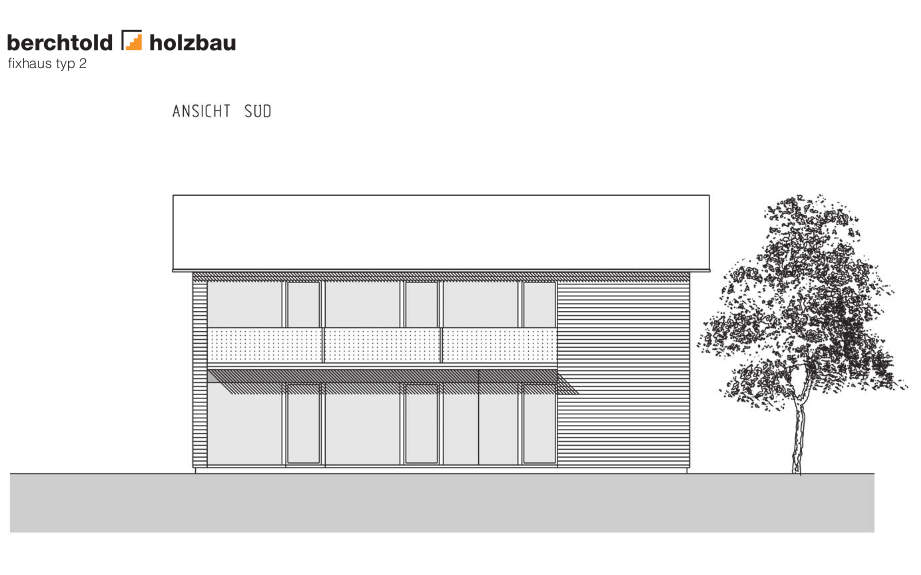
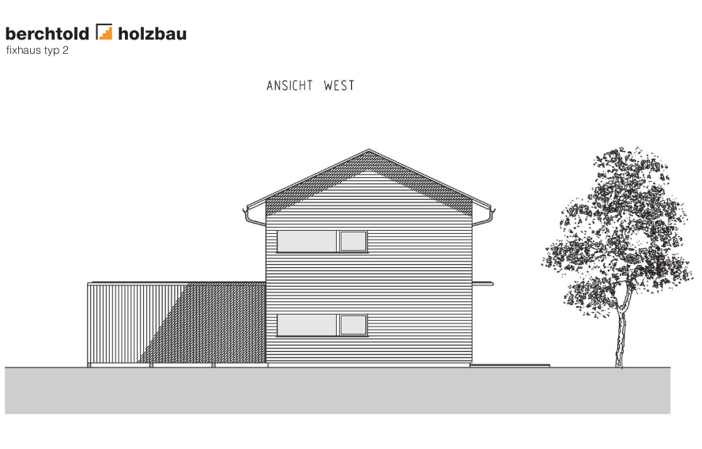
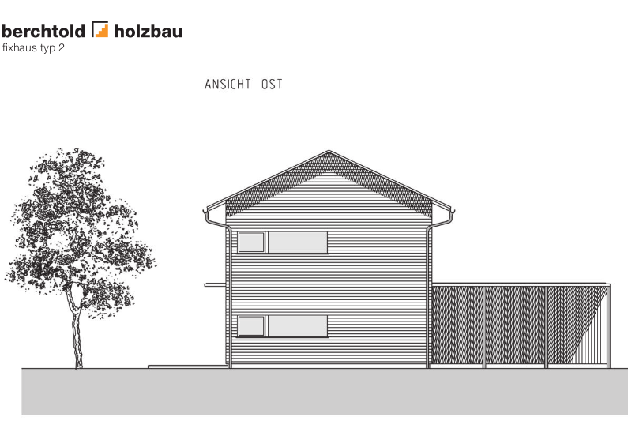
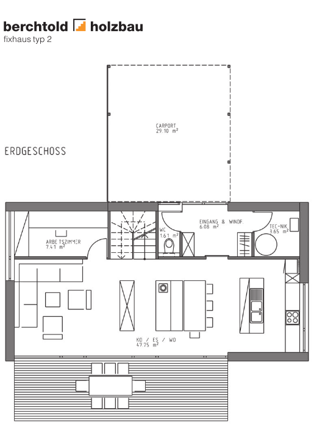
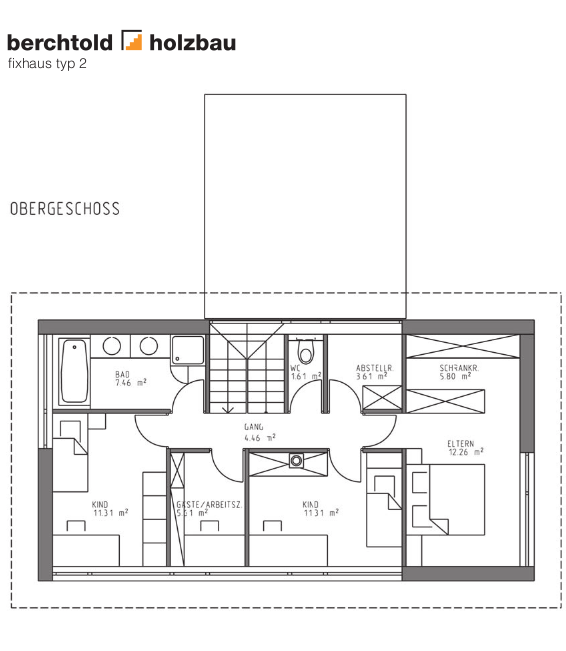

Introduction
==============

.. note::

  Cette initiation est composée de plusieurs documents : celui-ci, mais aussi d'autres, tels que :doc:`/su/config-su`, ou :doc:`/acad/config_acad` . Suivre cette initiation consiste donc à "naviguer" entre différents documents qui ne sont *pas tous* écrits dans le contexte d'une initiation.

Principe
--------

Pour aborder l'utilisation de ces logiciels complémentaires, nous allons
réaliser un tâche *concrète :*

* esquisse d'une maison *simple* sur **Sketchup**
* export sur **AutoCAD**
* impression au format pdf et sur papier

En effectuant ces dessins, nous utiliserons les commandes principales
d'édition, modification, export, etc. Nous serons donc *sensibilisés* à
l'environnement du(des) logiciel(s)

Objectif
--------

Acquérir des compétences initiales sur les logiciels  *Sketchup* et *AutoCAD*.

Par le biais d'une mise en situation immédiate, au travers de l'application d'une méthode pas-à-pas, **apprendre en faisant bien, la première fois**.

Acquérir une méthode de travail *reproductible*, en maîtrisant le maximum de paramètres (AutoCAD, de par son caractère généraliste, est compliqué à configurer correctement pour le dessin d'architecture), visant l'obtention d'une *qualité régulière*.

Le projet
---------

La recherche du modèle "idéal" à représenter est basée sur des critères multiples :

* **simplicité** : pour apprendre, c'est bien. On modélisera une maison individuelle basique
* **cohérence** : c'est là où la conception architecturale devient raisonnable... (i.e : dimensions entières (cm), ergonomie des pièces, etc.)
* **technicité** : on en profite toujours pour apprendre quelque chose. Nous nous intéresserons aux réponses apportées à:
    * *la lutte contre le réchauffement climatique* : construction à basse/très basse consommation énergétique
    * *le développement durable* : emplois de matériaux locaux, ayant nécessité peu d'énergie primaire de fabrication, facilement recyclables, etc.
    * *la santé* : utilisation de matériaux ne provoquant pas de maladies à court ou long terme, de façon connue ou supposée, de la mise en oeuvre pendant le chantier au recyclage, en passant bien sûr par l'utilisation au quotidien.
* **intéressant** : un modèle simple d'accord, mais si je pouvais ajouter mon "grain de sel" pour d'améliorer?

Il n'a pas été facile de choisir ... tellement l'offre est vaste en matière de constructions modernes, efficaces, belles.

Je me suis tourné vers un modèle assez évolué, proposé par un consortium d'architectes engagés dans une démarche commune promouvant l'habitat de type `Passiv Haus <http://fr.ekopedia.org/PassivHaus>`_ , de la région du `Voralberg <http://fr.wikipedia.org/wiki/Voralberg>`_ , fer de lance du développement "durable" en Autriche (quand on pense que 80% des chaudières sont alimentées par du bois, être à la pointe signifie avoir ... 20 ans d'avance par rapport à la France dans le même domaine!)

.. seealso::

    http://www.fixhaus.at/Berchtold%20Typ2.pdf
      la notice du projet, à télécharger : voir :ref:`demarrage_init_su+acad`
    http://www.berchtoldholzbau.com/pages/d_pages/seiten/fix_02.htm
      Si vous parler l'Autrichien couramment
    http://translate.google.fr/translate?js=n&prev=_t&hl=fr&ie=UTF-8&u=http%3A%2F%2Fwww.berchtoldholzbau.com%2Fpages%2Fd_pages%2Fseiten%2Ffix_02.htm&sl=de&tl=fr&history_state0=
      Version traduite automatiquement par Google ... si vous désirez progressez en Autrichien (le site est composé de beaucoup d'images fixes, non pas de texte)
    http://www.dailymotion.com/video/x24or4_vorarlberg-une-provocation-construc
      voilà comment tout à commencé ...au pays du développement*désirable*

Aperçu en images
~~~~~~~~~~~~~~~~
 et un de plus!

.. _fig-pers-porkeno:

	Modèle "Berchtold type 2" original

	Variante plus ouverte

	Façade Nord

	Façade Sud

	Façade Ouest

	Façade Est

	Plan Rez de chaussée

	Plan Étage

Analyse du modèle
~~~~~~~~~~~~~~~~~~

Type de construction
      habitation individuelle isolée,
      formes simples, sur 2 niveaux.
Principes "PassivHaus" 
      isolation thermique renforcée (pas ou peu de ponts thermiques, isolation par l'extérieur, fenêtres triple-vitrage, etc.),
      prise en compte globale des phénomènes thermodynamiques en reagard des migrations de vapeur d'eau
      grande étanchéité à l'air (jonctions sol/murs, murs/murs, murs/planchers, murs/toit, murs/menuiseries, etc.),
      forme massive peu sensible aux fluctuations thermiques
      apport solaire passif : maximum de vitrages au Sud et minimum d'ouvertures au Nord
      VMC "double-flux" (récupération calories sur air vicié extrait)
      géothermie : puit canadien (récupération calories/frigories sur air "souterrain"), réseau fluide caloporteur (horizontal = 2 X surface construite! ou vertical, sur nappe phréatique)
      régulation de type "logique floue", axée sur la détection de présence (i.e. la VMC se déclenche si il y a du monde, etc.)
Modularité
      la conception architecturale inclut la fabrication qui est en général industrielle : il n'y a plus de contrainte météorologique, la qualité d'exécution est augmentée car mieux contrôlable et le coût total est diminué.
      Le chantier n'est plus qu'un lieu d'assemblage de panneaux formant des murs.
Matériaux
      *bois :* structure, revêtements, etc.

Travail réel sur ce projet
~~~~~~~~~~~~~~~~~~~~~~~~~~~~

Il ne reste plus qu'à activer le :ref:`demarrage_init_su+acad` du projet.

.. commentaire, n'apparaissant pas

.. Voir ce document :doc:`/fichiers`

.. Voir :file:`les *.pdf <../fichiers/teb-d/aides/acad/init_su+acad/dessins/pdf>`.

.. For example, to mark the selection “Start > Programs”, use this markup: :menuselection:`Start --> Programs`
