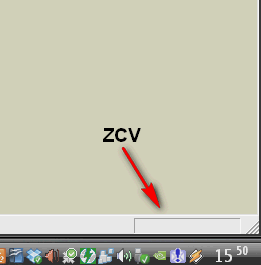

.. _su1:

Modélisation initiale dans |su|
====================================

.. note::
   Suivez les :ref:`notions-essentielles-su` avant de vous lancer dans le dessin à tout va!

Murs extérieurs
-----------------

1. Faisons un rectangle de 12,63 m X 6,63 m, puis "évidons-le" en son centre pour ne laisser qu'une bande de 36 cm (=largeur des murs) :

   * **R** (ou clic sur |ic-mesure|) : activation outil *Rectangle*
   * premier point : clic sur coin gauche supérieur des murs (à l'extérieur)
   * deuxième point : rentrez les dimensions suivantes dans la ZCV : ``12,63;6,63``
   * **Spc** (= barre d'espace ou clic sur |ic-selection|) : activation outil *sélection*
   * double-clic au centre du rectangle (la surface est sélectionnée ainsi que les bords)
   * **F** (ou clic sur |ic-decalage|)
   * sélectionner un bord
   * **Tab** (= aller dans la ZCV, ou clic dans la |ZCV| avec le pointeur), et rentrer ``36cm`` (attention à ne pas oublier d'inscrire l'unité ``cm`` juste après le 36, sinon, ça fera des murs de 36 m!)
   * **Spc** , clic au centre du rectangle et suppression de la zone centrale.

.. note::
   On peut indiquer une unité de dimension différente de celle spécifiée dans le modèle de dessin. Il suffit de l'écrire juste après le nombre dans la ZCV

#. Création d'un **groupe :** cette action permettra d'isoler l'objet du reste du dessin (utile pour le déplacer sans rester "collé" aux reste de la géométrie)

   * double-clic dans la bande restante (la surface *et* tous les bords sont sélectionnés (pointillés + bleu "gras")
   * :menuselection:`clic-droit --> Créer groupe`
   * édition du groupe : double clic (affichage d'une boîte englobante en pointillé et estompe des autres géométries)

#. "Élévation" des murs : extrusion avec l'outil "Push-Pull"

   * **P** (ou clic sur |ic-pushpull|)
   * **Tab** (on est dans la ZCV...) : rentrez ``6`` (pour 6 m de hauteur "estimés" pour les 2 niveaux)

#. Hauteur exacte des murs extérieurs

   * *Problème :* sans information plus complète, il est impossible de connaître la hauteur exacte de ces murs!
   * *Solution :* (identique à :ref:`import-ssqu`)
      - récupérons une image de la façade Sud `ici <http://www.canopee.org/fichiers/teb-d/aides/acad/init_su+acad/dessins/pdf/fixhaus_Berchtold-Typ2_fac-sud.pdf>`_
      - enregistrons-là dans ``../porkeno/dessins/pdf/``
      - transformons-la en \*.png
      - importons-là dans |su|, en la collant contre le mur "Sud" (premier coin en bas à gauche, deuxième à l'intersection coin supérieur mur/ bord droit image)
      - redimensionnons-là (outil mesure --> 1er & 2ème clic --> nouvelle valeur dans la ZCV, en utilisant la seule dimension connue : ``12,36``)
      - déplaçons l'image pour que les origines coïncident, en utilisant l'outil "déplacer" (raccourci : **M**, ou clic sur |ic-move|)
      - ajustons la hauteur du mur en se basant sur l'image
      - ce processus est long, pour arriver à l'estimation de départ : ~ 3 m de hauteur!

.. note::
   Dimensions du modèle : **stop aux approximations!** : si il faut recommencer l'étape précédente pour chaque façade, le cloisonnement intérieur, etc. ça risque de devenir fastidieux!

   Nous proposons donc de télécharger un pdf mentionnant toutes les cotes principales : `porkeno_plan-simple.pdf <http://www.canopee.org/fichiers/teb-d/aides/acad/init_su+acad/dessins/pdf/porkeno_plans-simples_o.turlier_03juin09_09h00.pdf>`_

..   :alt: PDF icon
..   :target: ./Documentation-TEB.pdf

.. |ic-pushpull| image:: ../su/img/ic_pushpull.png
   :height: 20
   :width: 20

.. _porkeno-plans-simples:

Cloisons
---------

En nous basant sur les dimensions du document `porkeno_plan-simple.pdf <http://www.canopee.org/init_su+acad/fichiers/porkeno_plans-simples_o.turlier_03juin09_09h00.pdf>`_, nous pouvons aisément tracer les cloisons.

..	marche pas ? See :download:`this example script <../example.py>`.

Au préalable (c'est une bonne habitude à prendre sur tout logiciel comportant des calques ...), nous allons créer un calque contenant les cloisons.

lignes de construction :
   En nous aidant des dimensions présentes dans le \*.pdf, créons des *lignes de construction* (outil mesure **T**), réprésentant l'implantation au sol des cloisons.

ligne :
   Avec l'outil ligne **L**, tracons le contour au sol des cloisons (sans tenir compte des ouvertures). |su| reconnaît un contour, il crée une surface.

groupe :
   double/triple cliquons sur cette surface --> clic-droit --> créer un groupe.

extrusion :
   activons l'édition de ce nouveau groupe en double-cliquant dessus.
   outil "pousser/tirer" **P** : rentrez la valeur de ``2,50`` (hauteur d'étage - épaisseur plancher)

.. note::
	**dimensions du projet** : au fur et à mesure de l'avancement de l'esquisse, nous prenons des "distances" par rapport au modèle originel. De toute façon, on ne dispose que de très peu 		d'informations sur celui-ci ...

	Afin d'optimiser les dimensions pour arriver à des cotes "entières", nous sommes arrivés à :
		* dimensions hors-tout : façade = **12,62 m** (au lieu de 12,63m), pignon = **6,62 m**
		* hauteur d'étage : **2,80 m**
		* épaisseur de plancher : **30 cm**
			- carrelage + colle : 1cm
			- chappe sèche "Fermacell" en 2 couches : 2 cm
			- isolant thermo-acoustique laine de bois dense : 6 cm
			- panneau bois contre-collé (type KLH,Leno,MHM,etc. : une épaisseur de 95mm est suffisante, mais ...) : 20 cm
			- fermacell en sous face : 1 cm (pièces humides)
		* épaisseur murs extérieurs : **36 cm**
			- crépi minéral (type monocouche) ou bardage terre cuite ou bardage bois : 1,5 cm
                        - panneau de fibres bois aggloméré au ciment, type fibralith qualité "extérieur", heraklith, etc. (pour accroche enduit monocouche et augmentation inertie thermique pour confort d'été)  : ep 3,5 cm
			- isolant fibre de bois rigide, dens. env. 160 kg/m3, type "steico therm" (inertie & isolation thermique "confort d'été") : 6 cm
                        - isolant fibres de bois semi-rigide, dens. env. 50 kg/m3, type "steico flex" (isolation thermique) : 10 cm
			- mur porteur panneaux bois contre-collé (raboté 1 face intérieure) : 14 cm
			- (éventuellement, en pièces humides notamment) : panneau Fermacell :  + 1 cm
		* épaisseur des cloisons : **7,1 cm**
			- panneaux bois contre-collé raboté 2 faces de 71 mm
			- prévoir habillage plaques de fermacell + faïence en pièces humides : + 1 cm
		* épaisseur de la toiture rampante : **50 cm**
			- tuiles + liteaunage : 4 cm
			- isolant fibre de bois (pose en "sarking") : 30 cm
                                 - isolant/pare-pluie fibre de bois rigide, type "steico universal" : 6 cm
                                 - isolant fibre de bois semi-rigide, dens. env. 50 kg/m3, type "steico roof" : 24 cm
			- panneau bois contre-collé : 16 cm
			- (éventuellement, selon les restriction imposées par la règlementation incendie)  1 plaque de fermacell : 1 cm

Les cloisons sont donc extrudées à une hauteur de 2,50 m, de façon uniforme, **sans tenir compte des ouvertures**.

placement des portes :
	Affichez la fenêtre "composants" : vous trouverez quantité de portes (|su| 6 : il faut installer les composants "Architecture au préalable ...)
	Positionnez-les en vous aidant avec des lignes de construction que vous aurez tracé à partir des arêtes des cloisons.
	Attention au sens d'ouverture! Si le composant s'ouvre dans le mauvais sens, vous pouvez tenter de le faire tourner avec l'outil déplacement, sinon, essayez l'outil échelle, et au lieu d'étirer l'objet, réduisez sa largeur, puis continuez encore, jusqu'à "inverser" celui-ci : vou venez de faire un "miroir"

Plancher
--------

Sans rentrer dans les détails (différentes couches ...), mettez une "plaque" de 30 cm au-dessus des cloisons

Export vers Autocad
----------------------

Votre modèle 3D est fini? Par *fini*, on entend que les éléments ci-dessous soient présents :
   * Plancher
   * murs extérieurs
   * cloisons
   * équipements : sanitaires, cuisine ...
   * mobilier

Les calques doivent organiser l'information selon 2 critères (simultanément) : objet + lieu. Ainsi, on retrouvera un calque pour les murs extérieurs au R+0, mais aussi un calque pour les mêmes murs, mais au R+1. Finalement, la liste des calques doit ressembler à ceci, selon que l'on veuille activer l'affichage de tel ou tel niveau :

..      :width: 600
	:align: center

	Calques pour voir uniquement le R+0

.. figure:: img/calques-r+1.png
..      :width: 600
	:align: center

	Calques pour voir uniquement le R+1

Pour visualiser l'habitation niveau par niveau, on aurait pu faire plus simple : un calque "R+0" regroupant tous les aobjets du niveau éponyme, et un calque "R+1" ... L'important est que l'on puisse afficher soit un niveau , soit l'autre.

Pour exporter vers |acad|, allons voir une technique |su| bien pratique :ref:`export-dwg`

.. |su| replace:: Sketchup

.. |acad| replace:: AutoCAD

