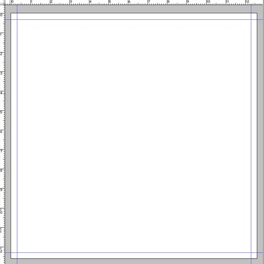
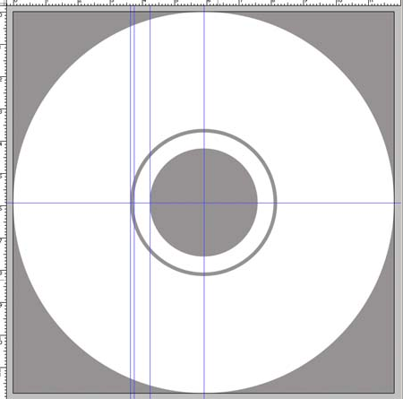

Préparer une jaquette de CD
============================

texte entièrement sorti de http://www.octopussy-world.comdossiers/jaquette.php . Je remercie Vivien GROS pour la clarté de ses explications.

Pourquoi?
----------

Imaginez votre projet enfin terminé : les plans, coupes et façades, mais aussi les plans de vente, les perspectives et autres rendu, etc.

C'est le moment de l'immortaliser sur un CD que vous distriburez au monde entier ... heu à votre secretaire ... pour archive ...

La face
---------

Une jaquette a des dimensions trés précises.

Pour la Face ou la Front créez donc un document de 12,6cm par 12,6cm avec une résolution de 300ppi (pixels par pouce).

.. note::
	Pourquoi 12,6cm alors que lorsque je mesure la Front d'un CD existant je trouve 12cm ?
	Eh bien tout simplement pour créer un fond perdu. Un fond perdu sert de "marge d'erreur". Si vous imprimiez votre document sans fond perdu, c'est à dire aux dimensions exactes (12cm x 12cm), au moment de la découpe il y aurait le risque de voir apparaitre une fine bande blanche sur les bords, résultant d'un certain manque de précision. L'ajustement de la découpe ne se fait pas au dixième de mm près, il faut donc prévoir un petit débordement de l'image : le fond perdu. Communément le fond perdu est de 3mm de chaque côté. Il peut être de plus mais jamais de moins

Maintenant il faut placer des repères afin de définir la zone de travail effective, celle qui se verra vraiment, le carré de 12x12cm.

Affichez les règles : :kbd:`Ctrl+R` ou :menuselection:`Affichage --> Afficher les règles` si ce n'est déjà fait.

Faites un :kbd:`ClicDroit` sur une règle et choisissez dans le menu contextuel qui apparait `cm`. Vous avez vos côtes en cm.

Pour créer un repère vertical, il suffit de placer votre curseur sur la règle verticale, d'enfoncer le clic et sans le relacher de déplacer le curseur sur le document (le repère est créé). En vous servant des règles placez des repères à 3mm de chaque bord.

Vous obtenez ceci :

L'arrière
-----------
Maintenant il ne vous reste plus qu'à faire pareil avec le Dos ou le Back. Dimensions du Dos : 15,6 cm par 11,8 cm. Largeur des tranches du Dos : 6 mm.

Ce qui devrait vous donner ceci :

.. image:: img/faire_jaquette_cd_02.png
	:width: 70%

Le rond du CD
--------------
Si vous deviez aussi vous occuper du CD en lui-même voici ses côtes :

* Diamètre : 11,8cm
* Diamètre du trou central : 3,4cm

Il existe une fine bande d'1 mm non-imprimable située à 3,6cm du bord.

Maintenant il est tout à fait possible que votre imprimeur vous demande de ne pas vous occuper du milieu et de fournir une image avec le centre plein. Toute fois je vous conseille vivement de garder ces cotes là en mémoire histoire de ne pas vous retrouver ensuite avec un texte ou un logo coupé !

.. note::
	1. Il n'y a pas de fond perdu pour le CD
	2. Il n'est pas necessaire de fournir un document en 300dpi pour le CD. Du fait de la surface du CD, l'encre bave légerement, donc tous les petits détails risquent d'être un peu "flou".

	Je vous conseille une résolution de 150ppi.

Vous devriez donc obtenir ceci :

La facilité
------------
Comme l'auteur est quelqu'un de très très sympa (si, si), il vous propose en libre téléchargement ses gabarits (au format :file:`*.psd`). Vous pourrez donc comparer votre travail avec celui-ci : :download:`gabarit_jaquette-CD<./fichiers/all_CD.zip>`

Maintenant il ne vous reste plus qu'à débrider votre créativité pour faire de jolies jaquettes!

