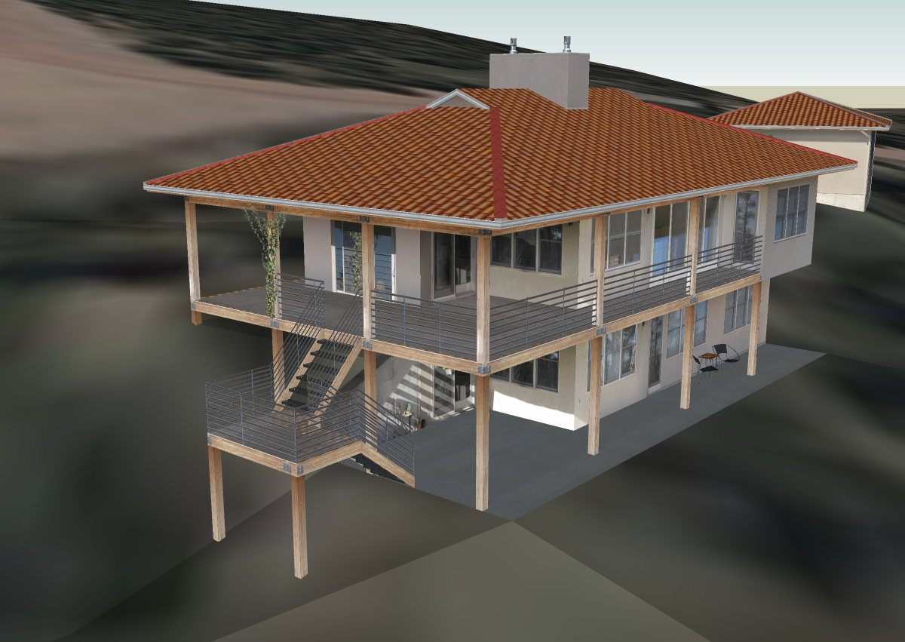
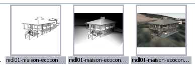
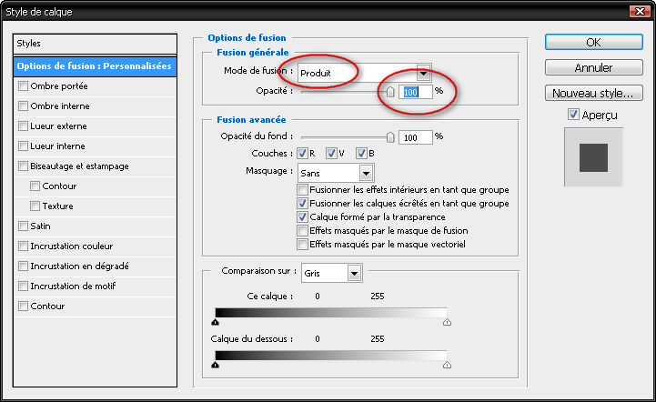
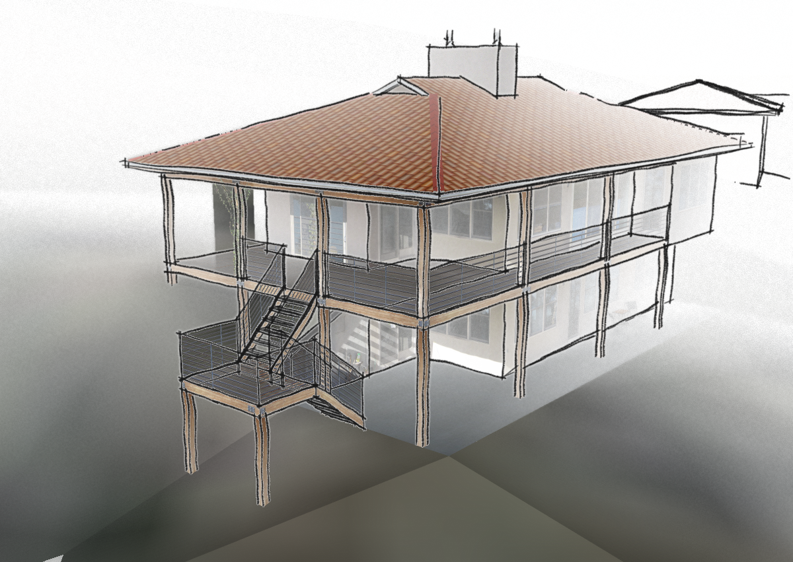

 .. _prepa_image_su+psd:

Préparation de la perspective
===============================

Sketchup
-----------

Importation du modèle
~~~~~~~~~~~~~~~~~~~~~~

* télécharger un modèle de maison type sur "l'entrepôt 3D" de google *3D Warehouse*, on prendra un modèle moderne, dans l'esprit "écoconstruction". Cliquez sur le lien et enregistrez le fichier sur votre disque dur : http://sketchup.google.com/3dwarehouse/details?mid=77f4a9f5ee868f9e972ec726e7a08cca&prevstart=0

* vous pouvez utiliser tout autre "matériau". Allez voir la section :ref:`demarrage_init_su+acad` du projet "porkeno" pour voir si vous avez effectué quelquechose dans ce domaine ...

* on ouvre le dessin dans sketchup, et on le dispose de 3/4 arrière, pour simuler une perspective.

Ce placement est important car dans le résultat final, on tentera de faire apparaître une extrémité en premier plan en couleur+texture, tandis que l'arrière-plan du modèle apparaîtra en blanc+arêtes et flou en prime. (voir le résultat final) .

Une fois l'orientation choisie, on ne bougera plus le modèle!

L'idéal est de créer une scène.

Création des scènes
~~~~~~~~~~~~~~~~~~~~

Par le menu :menuselection:`Fichier > Exporter > Graphique 2D`, on va faire **3** images.

Ces images seront exportées à partir de "scènes" qui correspondent à la même perspective, mais avec des styles différents.

..
	.. image:: img/capt_ng_sketchup_su+psp_rendu-facades_01.png
		:width: 50%
	.. image:: img/mdl01-maison-ecoconst-vast_ombre+couleur.png
		:width: 50%

1. **Perspective couleur**

Cette scène sert base de travail, on y peaufine  le positionnement du modèle (3/4 arrière, en fonction de linsertion ultérieure, donc du terrain ...

* Réglons l'affichage :

	* Affichage > Style d'arêtes > décochez tous les types d'arêtes
	* Affichage > Style de faces > Ombré avec textures

..
	.. image:: img/mdl01-maison-ecoconst-vast_croquis.png
		:width: 70%

2. **Perspective style "croquis" noir et blanc**

Export d'une image sur fond blanc, avec les arêtes soulignées. Cette image sera utilisée pour afficher les arêtes en superposition de l'image en couleur (avant-plan) et pour afficher uniquement les arêtes en arrière plan, dans Photoshop :

* Affichage > Style d'arêtes > afficher les arêtes \& arêtes profilées \& arêtes prolongées
* Affichage > Style de faces > lignes cachées
* fenêtre > Style > sélectionnez le style : Arêtes de croquis > Croquis au marqueur
* éditez le style, en réglant le niveau de détails au maximum

..
	.. image:: img/capt_ng_sketchup_su+psp_rendu-facades_03.png
		:width: 50%
	.. image:: img/mdl01-maison-ecoconst-vast_fog.png
		:width: 50%

3. **Perspective style "croquis" + brouillard**

Export d'une image sur fond noir, avec un flou dans l'arrière-plan créé par un "brouillard". L'objectif est d'avoir un arrière plan très sombre et un avant plan très clair. Cette image sera utilisée pour le remplissage du masque de fusion, dans Photoshop :

À partir de l'affichage précédent (Style > Croquis au marqueur = fond blanc + trait noirs forts)
* afficher la fenêtre brouillard : Fenêtres > Brouillard
* réglages des options de brouillard :
	- cochez "Afficher le brouillard"
	- décochez "Utiliser la couleur d'arrière plan"
	- cliquez dans le carré blanc pour ouvrir le sélecteur de couleurs
	- faites glisser le curseur vers le bas pour obtenir du noir
	- validez par OK : le fond devient noir
	- avec les curseurs de la barre centrale (il se déplace à la souris, ou – plus finement – en cliquant dessus puis en utilisant les flèches directionnelles gauche et droite) :
	- faites glisser le curseur droit vers la gauche : le brouillard \quote{ avance}(obscurcissement sur l'arrière)
	- faites glisser le curseur gauche vers la droite : l'éclairement se renforce sur l'avant

Exportation des images
~~~~~~~~~~~~~~~~~~~~~~

1. Pour la première scène créée,

	* réglons l'export des images :

		- Fichier > Exporter > Graphique 2D
		- Type d'exportation > portable network graphics (:file:`*.png`)
		- Options > Largeur = 1200, hauteur =~ (automatiquement fonction de la largeur), Anticrénelage
	* Cliquez sur Exporter

		- en personne bien organisée, choisissez un lieu sûr parce que évident pour stocker vos image : le dossier `dessin/images` de votre projet!
		- une appelation explicite est mère de clarté, quelquechose comme :file:`porkeno_perspective_couleur.png` me semble correct
2. Pour la 2ème scène

	* négligez les options d'exportations, elles restent configurées comme pour la fois précédente
	* exporter et enregistrez en donnant un nom légèrement différent, comme :file:`porkeno_perspective_croquis.png`
3. Pour la 3ème scène : :file:`porkeno_perspective_brouillard.png`

Photoshop
----------
Ouverture des images
~~~~~~~~~~~~~~~~~~~~~
Ouvrez les 3 images précédemment exportées :

* lancez Photoshop
* :command:`ctrl+o` et sélectionnez l'ensemble des images à ouvrir, soit :

Travail sur l'image de couleur
~~~~~~~~~~~~~~~~~~~~~~~~~~~~~~~

Renforcement des arêtes de l'image de couleur :
* placez-vous sur l'image à fond blanc et arêtes vues :

	- sélectionner l'ensemble :kbd:`ctrl+a`
	- copiez :kbd:`ctrl+c`
* placez-vous sur l'image en couleur :

	- collez l'image précédente :kbd:`ctrl+c` : un nouveau calque apparaît, au-dessus du calque contenant l'image en couleur
	- double-cliquez sur l'icône du calque (ou faites un :kbd:`clic-droit` --> option de fusion) pour ouvrir le dialogue de fusion (avec le calque sous-jacent)
	- mode de fusion > produit, & laissez les autres options intouchées. Le mode "produit" permet d'afficher uniquement les ombres du calque supérieur (les zones blanches disparaissent). Vous remarquerez que l'image en couleur du calque inférieur voit ses arêtes "renforcées".

Fondu entre les 2 calques :
* placez-vous sur l'image au fond noir :

	- sélectionner l'ensemble : {\bf ctrl+a}
	- copiez : {\bf ctrl+c}
* placez-vous sur l'image en couleur :

	- désactiver la visibilité de tous les claques, en cliquant sur les icônes représentant des yeux, sur la gauche des icônes de calque
	- créez un masque de fusion en cliquant sur l'icône en bas du panneau des calques, ou par le menu Calques > masque de fusion > tout faire apparaître
	- appuyez sur la touche alt et cliquez sur l'icône du masque de fusion : la zone d'image se remplit de blanc : on vient d'activer le masque, donc toutes les modifications que l'on fait à présent se font sur le masque de fusion.
	- collez l'image à fond noir dans le masque de fusion : {\bf ctrl+v} sur la zone d'image.
	- ré-affichez les calques, et annulez la sélection en cours : {\bf ctrl+d}

Effet de flou
~~~~~~~~~~~~~

.. image:: img/capt_ng_sketchup_su+psp_rendu-facades_10.png
	:height: 600

* Placez-vous sur l'image en couleur
* sélectionnez le calque contenant le masque de fusion
* Filtre > Atténuation > Flou de l'objectif
* Source > masque de fusion
* Flou de la distance focale > 255
* Rayon > 10
* laissez le reste inchangé
* et admirez le résultat !

