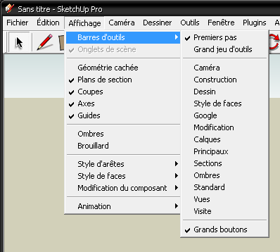
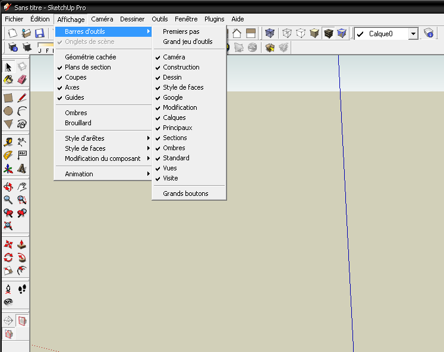
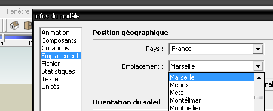

.. _config-su:

Configuration de Sketchup
=========================

Configuration Initiale
-----------------------
Interface graphique
~~~~~~~~~~~~~~~~~~~

Après l'installation, Sketchup nous offre une interface assez pauvre :

.. figure:: img/su_001.png
   :align: center
   :alt: Sketchup en configuration initiale

   **Fig** Sketchup en configuration initiale

Un petit coup de :menuselection:`Affichage --> barre d'outils`, qui doit ressembler à ça :

   **Fig** Cochez toutes les barres d'outils

Nous proposera tous les outils basiques nécessaires :

   **Fig** Sketchup configuré correctement

Spécifications des unités de travail, etc.
~~~~~~~~~~~~~~~~~~~~~~~~~~~~~~~~~~~~~~~~~~~~

Par le menu :menuselection:`Fenêtre --> information du modèle`

* **Emplacement géographique :**

   **Fig** emplacement géographique

* **Unités :** *de longueur :* format décimal : **mètres**, précision : 0,00,  *angulaire :* précision : 0,00
* **Cotation :** aligner texte sur ligne de cotation, *au-dessus*

.. note::

  Pour un dessin d'architecture concernant un projet neuf, il est préférable de travailler en **mètres**.
  Certains préfèrent le **cm**, ils ont raison tant que l'on reste dans des dimensions petites (maison individuelles). Dessiner un immeuble mettra fin à leur préférences!

  Le dessin en **cm** est enviseageable pour les dessins de mise au net de relevé de bâtiment existants.

.. todo:: config-su : largeur images identiques!

.. _config-su-02:

Configuration avancée
-----------------------
Plugins
~~~~~~~~
Il y a plein de plugins pour Sketchup qui permettent un travail plus aisé.

.. todo:: ajout & install plugins dans SU : SCF toolbars, 1001, bezierspline, windowiser, sketchyffd

Nous allons Configurer SU pour utiliser les (excellentes) barres d'outils SCF, téléchargeables sur ce site. Pour cela, il faudra remplacer les barres d'outils originelles

.. seealso::

   http://www.special.eclipse.co.uk/_ruby.html
      SCF toolbars : powerbar, selector, drawtools, standard tools et archiland toolbar
   http://www.casttv.com/video/xqa81g1/scf-toolbar-sketchy-bevel-video
      Vidéo : *Sketchy bevel* (une application de la barre d'outil SCF "powerbar")
   http://www.casttv.com/video/5lrv85/scf-toolbar-protrude-video
      Vidéo : *protusion*

Ensuite, nous allons installer des plugins "individuels" :

   http://www.sketchucation.com/forums/scf/download/file.php?id=25306
      Shape bender
   http://www.crai.archi.fr/RubyLibraryDepot/Ruby/fr_RUBY_Library_Depot.html
      Tous les plugins sur un seul site, en Français!
