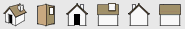
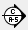

.. _export-dwg:

Export vers le dwg
===================

Un modèle 3D, c'est bien pour la visualisation, mais ça peut être pratique de l'exporter vers un logiciel de dessin plus abouti tel qu'|acad|. On pourra ainsi le dimensionner avec aisance, l'imprimer en pdf ou en papier à l'échelle, etc.

Sachant que l'export consiste à extraire une géométrie 2D d'un modèle tridimensionnel, Il existe 2 méthodes pour aboutir (à peu près) au même résultat :

Vues prédéfinies (avant/arrière, cotés)
------------------------------------------

   * :menuselection:`caméra --> projection parrallèle` (aucune déformation)
   *  choisir une vue prédéfinie, par exemple facade avant (correspond par exemple à la facade Ouest du modèle)
   * :menuselection:`exporter --> graphique 2D ...`
      - type d'exportation : |acad| dwg
      - options (par bonheur, |su| mémorise les derniers paramètres : on ne recommencera pas pour l'export suivant!) :
      - échelle réelle 1:1
      - version : autocad 2007
      - lignes profilées : aucunes
      - arêtes prolongées : à décocher
   * enregistrez le fichier (idéalement, dans un sous-dossier "xrefs" relatif au dessin autocad regroupant toutes ces vues) en ``<projet>_facade-ouest.dwg``. Pour une arborescence complète d'un projet, reportez-vous à cet :ref:`exemple <arborescence-projet>`
   * choisissez une autre vue, et recommencez les étapes pour l'export

.. note::
   Il est préferable d'organiser votre dessin avec des scènes, lesquelles contiendront les vues prédéfinies de votre modèle. C'est plus PRO! Reportez-vous à :ref:`creation-scenes` pour voir comment c'est possible.

Avec la richesse des vues prédefinies enregistrées dans des scènes correspondantes, (=travail préalable) l'export vers |acad| est mieux contrôlé.

.. _export-dwg-coupes:

Coupes
--------

Il suffit de faire une coupe en

* cliquant sur l'icône ci-dessus

* placer-là au bon endroit sur le modèle (vers + 1 m de hauteur pour faire un plan, etc.), (on peut bloquer son orientation en appuyant sur la touche :kbd:`maj` )

* et de faire :menuselection:`fichier --> exporter --> tranche de section` (au format :file:`*.dwg`)

Cette méthode à l'avantage d'être rapide, elle montre néanmoins les limites de |su| : l'export ne concerne que la "peau" extérieure de chaque volume (c'est normal, |su| est un modeleur 3D **surfacique**, les volumes sont "creux")

On peut remédier à cet inconvénient en installant le plugin **fr_SectionCutFace.rb** que l'on peut trouver sur le site suivant http://www.crai.archi.fr/RubyLibraryDepot/Ruby/FR_arc_page.htm ou, pour plus de facilité, directement :download:`ici<./fichiers/fr_SectionCutFace.rb>` .

Ce plugin, une fois installé (voir la méthode :ref:`install-plugin-su`), est uniquement activé lorsque l'on fait un :kbd:`clic-droit` sur la coupe et que l'on choisit l'option :command:`face de section`. Cette commande ajoute une face entre les arêtes générées par la coupe (nécessite un contour continu pour créer des faces "cohérentes")

.. |su| replace:: Sketchup

.. |acad| replace:: AutoCAD

.. |su| replace:: Sketchup

.. |acad| replace:: AutoCAD
