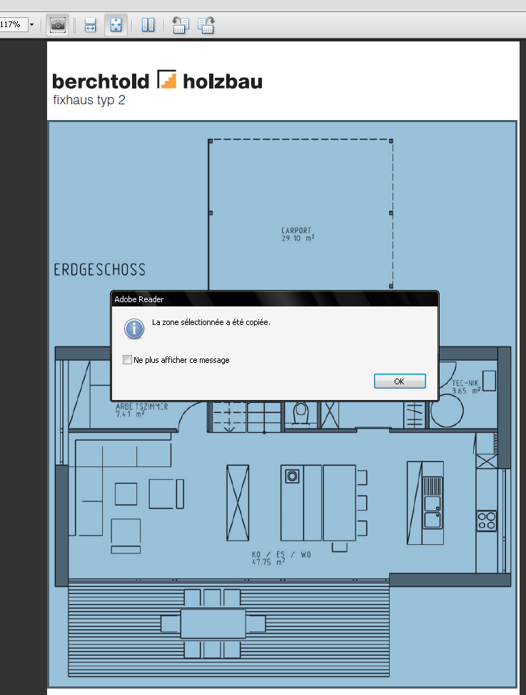

.. _import-ssqu:

Importation "fond de plan" dans Sketchup
=========================================

Nous disposons de \*.pdf du projet (renommés de fixhaus_berchtold2.. en porkeno..). Essayons de l'importer dans Sketchup.

Préparation du dessin
-----------------------

La configuration initiale de l'interface se poursuit ici. Chaque modification est enregistrée automatiquement par le logiciel : le prochain démarrage aura mémorisé les réglages de la "session" précédente.

Affichons des "palettes" (terminologie AutoCAD) directement dans la zone de dessin, essentielles à tout bon travail. Ces palettes sont "dockable" : elle peuvent se "coller" à un bord de fenêtre, etc. Elles sont aussi repliables : un clic sur la barre de titre (barre supérieure "épaisse" de la palette) les plie, un second la déplie.

.. _creation-calques-su-debut:

Calques
~~~~~~~~
.. note::
	Comme pour AutoCAD plus tard, il faut créer des "couches" de dessin qui recevront des objets similaires (*nature* : images, lignes épaisses, lignes fines, etc., ou *fonction* menuiserie intérieure, menuiserie extérieure, etc.)

1. Liste des calques à créer *avant* de dessiner quoi que ce soit : (une appellation explicite est plus facilement exploitable : donnez des noms compréhensibles à vos calques!)
	* import_img
	* murs_ext
#. Activation du calque
	* Un calque est rendu actif lorsqu'on clique dans le cercle situé à gauche de son nom : Activez ``import_img``

Information sur l'entité
~~~~~~~~~~~~~~~~~~~~~~~~~~

Le menu :menuselection:`Fenêtres --> Information sur l'entité`, vous afficherez la palette qui vous permettra de faire changer de calque les "entités" que vous aurez sélectionnées.

"Dockez" cette palette sous celle des calques et repliez-là, en cliquant sur la barre supérieure.

Importation en \*.pdf : NOK
-------------------------------------------

Problème : importation des images en \*.pdf impossible
~~~~~~~~~~~~~~~~~~~~~~~~~~~~~~~~~~~~~~~~~~~~~~~~~~~~~~~

:menuselection:`Fichier --> Import --> type de fichier --> tous les formats d'image supportés` :  le pdf n'est pas reconnu!.

Sketchup ne reconnaît pas le format *\*.pdf* comme un format d'image *importable*.

Il faut transformer ce pdf en un autre format qui sera utilisable.

Il existe plusieurs alternatives :

* ouverture du \*.pdf dans un logiciel pouvant en transformer le format vers le png, jpg, etc. :
	* Acrobat
	* Photoshop
	* Gimp
* capture d'image :
	* soit en utilisant les outils "windows" : touche [printscreen] pour capturer l'écran entier, ou [alt]+[printscreen] pour capturer la fenêtre active, puis ouverture d'un logiciel d'imagerie, et nouveau fichier, puis copie du contenu du "presse-papier" et enregistrement.
	* soit en utilisant un logiciel dédié : `Fastone Capture <http://www.faststone.org/FSCaptureDetail.htm>`_ , ou `Snagit <http://www.techsmith.fr/snagit.asp>`_ : l'enregistrement en sera simplifié.
	* capture avec l'outil **instantané**, présent dans *Acrobat reader* (à faire apparaître en faisant un clic-droit sur la barre d'outils et sélectionner "ajouter des outils").

.. note:: Beaucoup d'entre-nous confondent *Acrobat* et **Acrobat reader** : ce 2e logiciel n'est que le *visualisateur* de \*.pdf , téléchargeable gratuitement, mais aux possibilités limitées ... à la visualisation et l'impression.

Nous choisirons de "capturer" l'image ou la portion d'image avec l'outil instantané d'AcrobatReader, puis de copier cette capture dans Paint, pour obtenir une image que nous enregistrerons au format \*.png .

.. _capture-outil-acroread-instantane:

Capture du pdf avec l'outil instantané dans Acrobat Reader
~~~~~~~~~~~~~~~~~~~~~~~~~~~~~~~~~~~~~~~~~~~~~~~~~~~~~~~~~~~

Sélectionnez la zone à capturer avec cet outil :

.. _fig-outil-acroread-instantane:

.. image:: img/import_ssq_outil-instantane_01.png
	:width: 600
	:align: center

Ouverture d'un petit logiciel bien pratique  *PAINT* :

.. _fig_paint:
.. image:: img/import_ssq_outil-paint_03.png
	:width: 600
	:align: center

Dans Paint : "importation" de la capture réalisée par l'outil "instantané" (c'est un copier-coller entre applications différentes) :

.. image:: img/import_ssq_outil-paint_04.png
	:width: 600
	:align: center

Si l'image importée est plus grande que la zone prévue par le logiciel, autorisez celui-ci à agrandir la zone d'image :

Recadrage/Retaillage :

.. image:: img/import_ssq_outil-paint_06.png
         :width: 600
         :align: center

Importation en \*.png : OK
-------------------------------------------
Il ne reste plus qu'à enregistrer l'image en ``porkeno_plan-rdc.png``.

Activation du calque ``import_img``, créé plus haut :ref:`creation-calques-su-debut`

:menuselection:`Fichier --> Import --> type de fichier --> tous les formats d'image supportés` :
      * sélectionnez ``porkeno_plan-rdc.png``
      * utiliser comme image

premier point d'insertion : l'image apparaît "collée" au bout du pointeur cliquez sur l'origine (0;0;0)

deuxième point : à estimer selon la taille de l'image : si c'est la capture d'une page au format A4 portrait (c'est le cas ici) entrez ``20cm`` dans la zone de controle de valeurs (ZCV)

Mise à l'échelle de l'image dans Sketchup
-----------------------------------------

Suivez ce document :doc:`redimensionnement-images-outil-mesure` pour avancer à l'étape suivante.

.. .. todo:: mise à l'echelle dans su --> doc spécifique.

